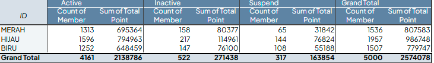
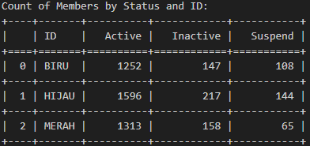
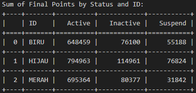
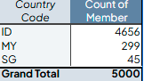
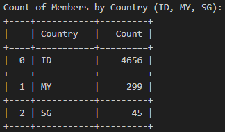

# 📊 Excel Test Data Processing

## 🚀 About the Project
This project focuses on processing and transforming raw data using **Excel formulas** and **Python scripting**. The objective is to clean, format, and analyze the given dataset efficiently. The key processing steps include:

### 🔹 Step-by-Step Processing
✅ **Extract ID** → Extract unique IDs from the "Data" tab.  
✅ **Format Phone Numbers** → Convert numbers into international format (`08123456789` → `+628123456789`).  
✅ **Assign Country Code** → Extract country codes from phone numbers.  
✅ **Clean Names** → Remove special characters and extra spaces.  
✅ **Clean Emails** → Fix email format issues.  
✅ **Convert Date Format** → Change dates to `YYYY-MM-DD`.  
✅ **Assign Extra Points** → Assign points based on given ID.  
✅ **Pivot Table Analysis** → Generate insights from data.  

## 📊 Pivot Table Analysis
A pivot table is created in Excel to analyze data distribution. The results are compared with Python-based calculations to ensure accuracy.

### 📌 Key Insights
📍 **Count of ACTIVE, INACTIVE, and SUSPEND members per ID**  
📍 **Total points for each status category (ACTIVE, INACTIVE, SUSPEND)**  
📍 **Member distribution by country (ID, MY, SG)**  
📍 **Country with highest total points from ACTIVE members**  

### 📸 Pivot Table Visualization
Below is the pivot table analysis performed in Excel:  
  

## ⚡ Python DataFrame Comparison
A similar analysis is performed using Python **(Pandas, OpenPyXL)** to validate the pivot table results from Excel. Since the results are identical, comparison visuals are provided instead of tabular differences.

### 📸 Python vs Excel Comparison
Here is the comparison of Excel pivot table and Python DataFrame analysis:
#### ✅ Count of ACTIVE, INACTIVE, and SUSPEND members per ID  
**Python Result:**  
  

**Excel Result:**  
  

#### ✅ Total points for each status category (ACTIVE, INACTIVE, SUSPEND)  
**Python Result:**  
  

**Excel Result:**  
  

#### ✅ Member distribution by country (ID, MY, SG)  
**Python Result:**  
  

**Excel Result:**  
  

#### ✅ Country with highest total points from ACTIVE members  
**Result:**  
**ID** has the highest total points from ACTIVE members.

## 💂 Tools Used

## 📂 Results & Resources
📁 **View the processed spreadsheet:** [Google Spreadsheet Link](https://docs.google.com/spreadsheets/d/1dtjhIuV8R6OaPlTbGOsL5GTyTRm6YTc-/edit?usp=sharing&ouid=114813118100710688109&rtpof=true&sd=true)  
🎨 **Visual Comparison**: See the pivot table and Python analysis above.  

---

🔥 **Created with 💙 using Python & Excel**
